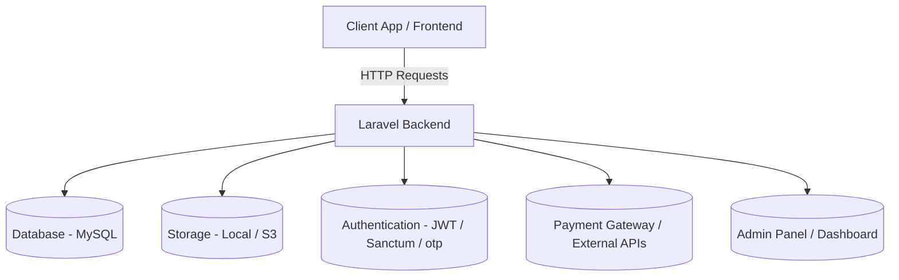

# 🚗 Car-Connect Backend

[](#license)
[]()
[]()
[]()
[]()

> Smart, connected, and secure — the backend engine powering **Car Connect**, your next-generation automotive platform.

---

## 🖥️ Overview

**Car-Connect Backend** is a robust API layer designed to power intelligent vehicle connectivity.  
It enables vehicles, users, and service providers to interact in real-time — supporting features like:

- 🔧 Vehicle diagnostics and data telemetry  
- 📡 Real-time tracking and control  
- 👥 Multi-user authentication and roles  
- 🧠 Integration with AI-based analytics  

Built for scalability, security, and integration with modern automotive systems.

---

## 🧱 Tech Stack

| Layer | Technology |
|-------|-------------|
| Framework | Laravel |
| Database | Mysql |
| Authentication | JWT + Role-based Access Control + otp |
| APIs | REST Apis|
| Infrastructure | Docker, Kubernetes, CI/CD |
| Logging | Winston / Morgan |
| Cloud | AWS / DigitalOcean / Render |

---

## ✨ Features

- 📡 **Real-time communication** between vehicles and servers  
- 🧾 **Secure REST API** for vehicle, user, and trip data  
- 🔐 **JWT authentication** for drivers, admins, and fleet owners  
- ⚙️ **Telemetry engine** — supports GPS, speed, diagnostics  
- 🧠 **Modular services** for scalability and maintainability  
- ☁️ **Cloud-ready** with Docker, Kubernetes & CI/CD support  

---

## 🗺️ Architecture Diagram


# ⚙️ Installation
1️⃣ Clone the repository
```bash
git clone https://github.com/AbdullahBakouni/car-connect-backend.git
cd car-connect-backend
```
2️⃣ Install dependencies
```bash
npm install
# or
yarn install
```
3️⃣ Environment setup

Create a .env file in the project root:
```env
PORT=3000
JWT_SECRET=your_secret_key
NODE_ENV=development
```
4️⃣ Run locally
```bash
php artisan serve
```
## 🧪 API Examples

Below are example endpoints available in the **Car-Connect Backend API**.  
All routes are prefixed with your API base URL (e.g. `https://localhost:3000/api/`).

---

### 🔐 Authentication

**Generate OTP**
```http
POST /api/generateOTP
Body:
{
  "phone": "+1234567890"
}

Response:
{
  "message": "OTP sent successfully",
  "otp": "123456"
}
```
Verify Code (Login via OTP)
```http
POST /api/verifyCode
Body:
{
  "phone": "+1234567890",
  "otp": "123456"
}
```

Login using Email
```http
POST /api/loginUsingEmail
Body:
{
  "email": "user@example.com",
  "password": "secret"
}
```

Get All Users
```http
GET /api/getUsers
Authorization: Bearer <JWT_TOKEN>
```

Add New Admin
```http
POST /api/addAdmin
Body:
{
  "email": "admin@carconnect.com",
  "password": "strongpassword"
}
```
⚙️ Vehicle Data

Add Car
```http
POST /api/addCar
Body:
{
  "user_id": 12,
  "brand_id": 3,
  "model_id": 7,
  "color_id": 2,
  "gear_id": 1,
  "price_per_day": 95.5,
  "description": "Tesla Model 3 2023 - full electric"
}
```

Get All Cars
```http
GET /api/getCars
```

Get Cars by Brand
```http
POST /api/getCarsByBrandId
Body:
{
  "brand_id": 3
}
```

Get Car Details
```http
POST /api/getCarDetails
Body:
{
  "car_id": 45
}
```

Toggle Car Availability
```http
POST /api/toggleCarAvailability
Body:
{
  "car_id": 45,
  "available": false
}
```
🧍 User & Business Accounts

Add Business User Profile
```http
POST /api/addBusinessUserProfileInfo
Body:
{
  "company_name": "AutoRent",
  "owner_name": "John Doe",
  "email": "contact@autorent.com",
  "phone": "+1987654321"
}
```

Get Business User
```http
POST /api/getBusinessUser
Body:
{
  "user_id": 5
}
```

Get All Business Users
```http
GET /api/getBusinessUsers
```

Upload User ID Image
```http
POST /api/uploadUserIdImage
FormData:
{
  "user_id": 5,
  "id_image": (file)
}
```
💳 Account

Add Balance
```http
POST /api/addBalance
Body:
{
  "user_id": 5,
  "amount": 150.00
}
```

Deduct Balance
```http
POST /api/deductBalance
Body:
{
  "user_id": 5,
  "amount": 50.00
}
```

Get Account Info
```http
POST /api/getAccount
Body:
{
  "user_id": 5
}
```
📦 Orders

Create Order
```http
POST /api/addOrder
Body:
{
  "user_id": 5,
  "car_id": 12,
  "amount": 450.00,
  "start_date": "2025-03-12",
  "end_date": "2025-03-15"
}
```

Change Order Status
```http
POST /api/changeOrderStatus
Body:
{
  "order_id": 99,
  "status": "completed"
}
```

Release Escrow
```http
POST /api/releaseEscrow
Body:
{
  "order_id": 99
}
```

Refund Escrow
```http
POST /api/refundEscrow
Body:
{
  "order_id": 99,
  "reason": "Car not available"
}
```
⭐ Ratings, Comments, Likes & Favorites

Rate a Car
```http
POST /api/rateCar
Body:
{
  "car_id": 12,
  "user_id": 5,
  "rating": 4.5
}
```

Add Comment
```http
POST /api/addComment
Body:
{
  "car_id": 12,
  "user_id": 5,
  "comment": "Excellent car and great condition!"
}
```

Like a Car
```http
POST /api/addLike
Body:
{
  "car_id": 12,
  "user_id": 5
}
```

Add to Favorites
```http
POST /api/addFavorite
Body:
{
  "car_id": 12,
  "user_id": 5
}
```

Get User Favorites
```http
POST /api/getUserFavorites
Body:
{
  "user_id": 5
}
```
🧾 Reports

Add Report
```http
POST /api/addReport
Body:
{
  "car_id": 12,
  "user_id": 5,
  "description": "The car has a broken light."
}
```

Get Car Reports
```http
POST /api/getCarReports
Body:
{
  "car_id": 12
}
```

Get All Reports
```http
GET /api/getAllReports
```
🗓️ Reservations

Add Reservation
```http
POST /api/addReservation
Body:
{
  "user_id": 5,
  "car_id": 12,
  "start_date": "2025-04-01",
  "end_date": "2025-04-05"
}
```

Get All Reservations
```http
GET /api/getAllReservations
```

Get Reservations by User
```http
GET /api/user/{userId}/reservations
```

Get Business User Reservations
```http
POST /api/getBusinessUserReservations
Body:
{
  "business_user_id": 3
}
```
# 🐳 Docker Setup
Build and run container
```bash
docker build -t car-connect-backend .
docker run -p 4000:4000 --env-file .env car-connect-backend
```
Or use Docker Compose
```bash
docker compose up -d
```
# 🛣️ Roadmap

 Add GraphQL support

 Add AI-based maintenance prediction

 Integrate WebSocket-based live updates

 Add fleet management dashboard

# 🤝 Contributing

Contributions are welcome!

Fork the repo

Create a branch (git checkout -b feature/amazing-feature)

Commit your changes (git commit -m "Add amazing feature")

Push your branch (git push origin feature/amazing-feature)

Open a Pull Request 🎉

# 📜 License

Licensed under the MIT License © 2025 [Abdullah Bakouni](https://github.com/AbdullahBakouni)

# 🌍 Visit My Website

👉 https://abdullahbakouni.vercel.app
